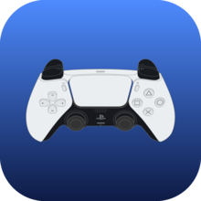
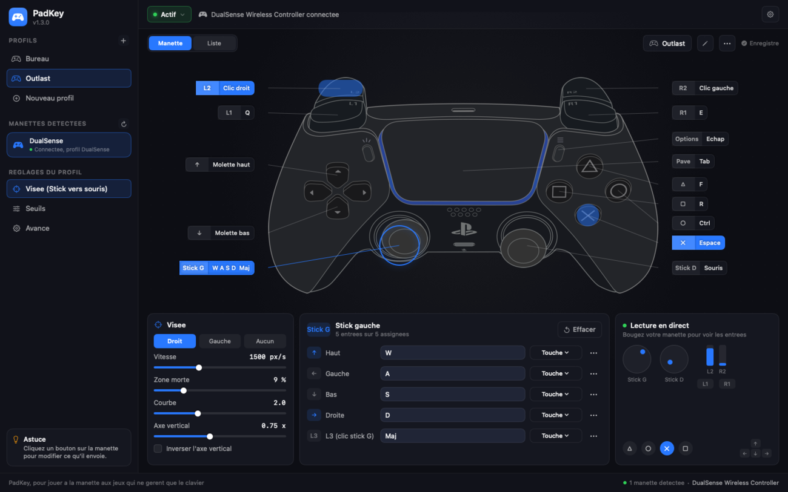
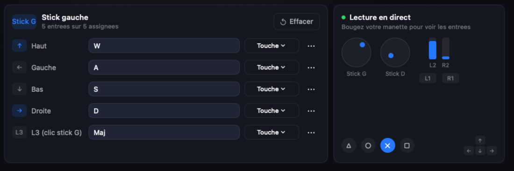
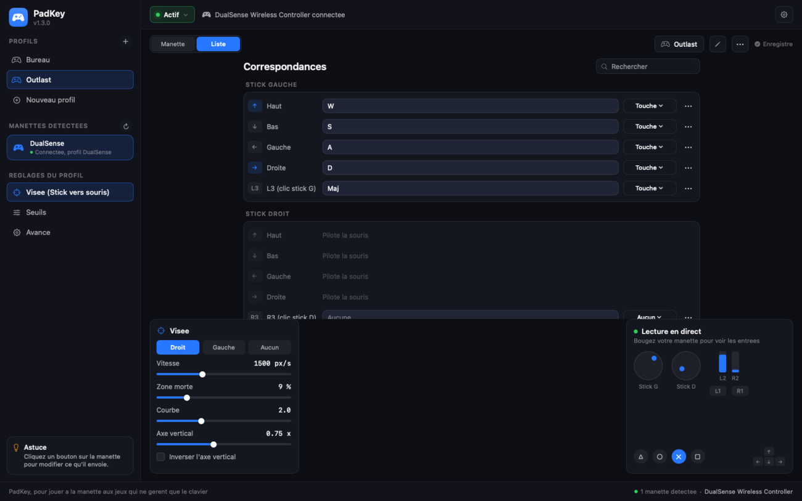

<div align="center">



# PadKey

**Jouer à la manette aux jeux Mac qui ne gèrent que le clavier et la souris.**

PadKey lit votre DualSense et envoie à votre place des appuis clavier, des clics
et des mouvements de souris. Le jeu ne sait pas qu'une manette existe : il voit un
clavier et une souris ordinaires.


[**Télécharger la dernière version**](https://github.com/dgadacha/padkey/releases/latest)

</div>



## Le problème

Beaucoup de jeux Mac ne gèrent pas la manette. Steam Input est censé combler ce
manque, mais il ne fonctionne bien que pour les jeux lancés depuis Steam, et il a
un effet de bord déroutant : il n'utilise pas votre manette, il en ajoute une
seconde, virtuelle, qui masque la vraie pour tout le reste du système.

PadKey s'attaque au problème autrement. Il lit la manette directement et traduit
chaque entrée en frappe clavier ou en geste de souris, dans n'importe quel jeu,
Steam ou non.

## Installation

Téléchargez l'image disque depuis la
[dernière version](https://github.com/dgadacha/padkey/releases/latest), ouvrez-la
et glissez PadKey sur le dossier Applications.

L'application est signée localement, sans compte développeur Apple, donc elle
n'est pas notarisée. Au premier lancement macOS la bloque : faites un clic droit
sur PadKey, puis Ouvrir, puis Ouvrir dans la boîte de dialogue. Si le blocage
persiste :

```bash
xattr -dr com.apple.quarantine /Applications/PadKey.app
```

Autorisez ensuite PadKey dans Réglages Système, Confidentialité et sécurité,
Accessibilité. **Cette autorisation est obligatoire** : sans elle, aucun événement
ne peut être envoyé aux jeux.

Pour construire depuis les sources :

```bash
./build.sh          # compile et installe dans /Applications
./package.sh        # fabrique dist/PadKey-<version>.dmg
```

## L'interface

La manette est au centre de l'écran. Chaque contrôle porte l'étiquette de ce qu'il
envoie, et se clique pour être modifié. Pendant que vous jouez, les boutons
pressés s'allument et les capuchons de sticks suivent les vrais sticks : c'est le
moyen le plus rapide de vérifier que PadKey lit bien la manette, et de repérer une
dérive ou une zone morte mal réglée.



Le panneau du bas édite le contrôle sélectionné. Un clic dans un champ met PadKey
en attente de frappe : appuyez sur la touche voulue, elle est enregistrée. Échap
annule. Les combinaisons avec Maj, Ctrl, Alt et Cmd sont capturées telles quelles.

Le mode Liste reprend les mêmes réglages sous forme de tableau, pratique pour
revoir un profil entier d'un coup.



## Profils

Trois profils sont installés au premier lancement.

| Profil | À quoi il sert |
| --- | --- |
| **Outlast** | Calqué sur le menu Contrôles du jeu |
| **FPS générique** | Base à dupliquer pour un autre jeu |
| **Bureau** | Piloter le Mac au canapé, curseur et clics |

Ce sont des fichiers JSON dans `~/Library/Application Support/PadKey/Profiles`.
L'interface les modifie, mais ils restent éditables à la main.

```json
{
  "name": "Mon jeu",
  "mouse": {
    "source": "rightStick",
    "speed": 1500,
    "deadzone": 0.09,
    "curve": 2.0,
    "verticalScale": 0.75,
    "invertY": false
  },
  "bindings": {
    "leftStickUp": { "keys": ["W"] },
    "l3": { "keys": ["Shift"] },
    "r2": { "mouse": "left" },
    "dpadUp": { "scroll": "up" },
    "options": { "keys": ["Escape"] }
  }
}
```

Entrées disponibles : `cross`, `circle`, `square`, `triangle`, `l1`, `r1`, `l2`,
`r2`, `l3`, `r3`, `dpadUp`, `dpadDown`, `dpadLeft`, `dpadRight`, `options`,
`create`, `ps`, `touchpad`, `leftStickUp/Down/Left/Right`,
`rightStickUp/Down/Left/Right`.

Une entrée peut déclencher :

| Clé | Effet |
| --- | --- |
| `"keys": ["Shift", "W"]` | Des touches, nommées par leur **position** sur un clavier QWERTY. Le `W` désigne la touche physique du W, soit le `Z` d'un AZERTY, ce que lisent la plupart des jeux |
| `"chars": ["z"]` | Un caractère résolu selon la disposition clavier active, pour les rares jeux qui lisent le caractère plutôt que la position |
| `"keycodes": [13]` | Un code de touche brut |
| `"mouse": "left"` | Un bouton de souris : `left`, `right` ou `middle` |
| `"scroll": "up"` | La molette, répétée tant que l'entrée est maintenue |
| `"autoRepeat": true` | Répète la touche tant que l'entrée est maintenue |

Sans `autoRepeat`, une touche reste simplement **enfoncée** tant que l'entrée est
maintenue. C'est ce qu'attend un jeu : le personnage avance sans s'arrêter. Dans un
éditeur de texte, un seul caractère s'affiche, parce que l'auto-répétition du
système ne s'applique qu'aux vraies frappes clavier. Activez `autoRepeat` pour
naviguer dans un menu.

## Réglages de visée

| Réglage | Ce qu'il fait |
| --- | --- |
| **Vitesse** | Pixels par seconde, stick poussé à fond |
| **Zone morte** | Course ignorée autour du centre. À monter si le curseur dérive |
| **Courbe** | 1 est linéaire, 2 à 3 donnent plus de finesse près du centre tout en gardant la vitesse maximale à fond. C'est le réglage qui rend la visée agréable |
| **Axe vertical** | Les jeux sont souvent plus sensibles en Y, 0,75 compense |

Les seuils de direction, de gâchettes et la cadence de la molette sont dans la
section Seuils.

## Steam

Le problème n'est pas Steam, c'est **Steam Input**. Quand il est actif, Steam prend
la main sur la DualSense et la remplace par une manette virtuelle générique : macOS
montre alors deux manettes, et la vraie ne renvoie plus rien d'exploitable.

**Pour un jeu Steam, ne fermez pas Steam.** Désactivez seulement Steam Input pour
ce jeu : Bibliothèque, clic droit sur le jeu, Propriétés, Manette, Désactiver Steam
Input. Steam continue de tourner et de lancer le jeu, mais lâche la manette.

Pour le couper partout : Steam, Réglages, Manette. Pour un jeu hors Steam, fermer
Steam règle la question d'un coup.

Le test qui tranche en dix secondes : ouvrez PadKey, bougez les sticks, et regardez
la lecture en direct. Si elle réagit, la manette est bien lue.

## Raccourcis

| Geste | Effet |
| --- | --- |
| Bouton **PS** maintenu une seconde | Coupe ou relance le mapping sans quitter le jeu |
| Double-clic sur PadKey dans le Finder | Rouvre la fenêtre, même si l'application tourne déjà |

## Diagnostic

```bash
/Applications/PadKey.app/Contents/MacOS/PadKey --diagnostic
```

Liste les manettes vues par macOS, l'état des autorisations, et affiche en direct
les sticks, les gâchettes et les boutons. Utile pour vérifier le matériel sans
passer par l'autorisation Accessibilité.

```bash
PadKey --test-touche     # une touche envoyée reste-t-elle enfoncée puis relâchée
PadKey --test-souris     # les mouvements de souris sortent-ils vraiment
```

Le test clavier passe par F13, il n'écrit donc nulle part.

## Développement

Swift Package Manager, aucune dépendance externe. La lecture de la manette passe
par **GameController**, l'injection par **CGEvent**.

| Fichier | Rôle |
| --- | --- |
| `MappingEngine.swift` | Boucle de lecture à 125 Hz, diff d'état, répétitions |
| `OutputSynth.swift` | Fabrication et envoi des événements clavier et souris |
| `Profile.swift` | Modèle des profils et des correspondances |
| `PadArtwork.swift` | Géométrie de l'illustration, relevée dans le SVG d'origine |
| `ControllerCanvas.swift` | La manette interactive |

Le harnais de rendu dessine la fenêtre hors écran dans un PNG, sans autorisation
d'enregistrement d'écran :

```bash
PadKey --snapshot capture.png --dark --demo --profile Outlast
```

Le numéro de version est dans le fichier `VERSION`, lu par `build.sh` pour le
bundle et par `package.sh` pour nommer l'image disque. L'historique est dans
[CHANGELOG.md](CHANGELOG.md).

## Limites connues

- Les jeux qui capturent la souris en plein écran attendent des mouvements
  relatifs. PadKey en envoie, mais quelques moteurs anciens filtrent les
  événements de synthèse.
- La vibration et les gâchettes adaptatives de la DualSense ne sont pas utilisées :
  un clavier ne renvoie rien au jeu.
- L'autorisation Accessibilité doit être réaccordée après chaque `./build.sh`, la
  signature locale changeant à chaque compilation.

## Crédits

Les visuels de manette viennent du
[Gamepad Asset Pack](https://github.com/AL2009man/Gamepad-Asset-Pack) d'AL2009man,
sous licence MIT, créés à l'origine pour
[VSCView](https://github.com/Nielk1/VSCView). L'icône de l'application est composée
à partir de ces mêmes visuels. Voir [Resources/CREDITS.md](Resources/CREDITS.md).
